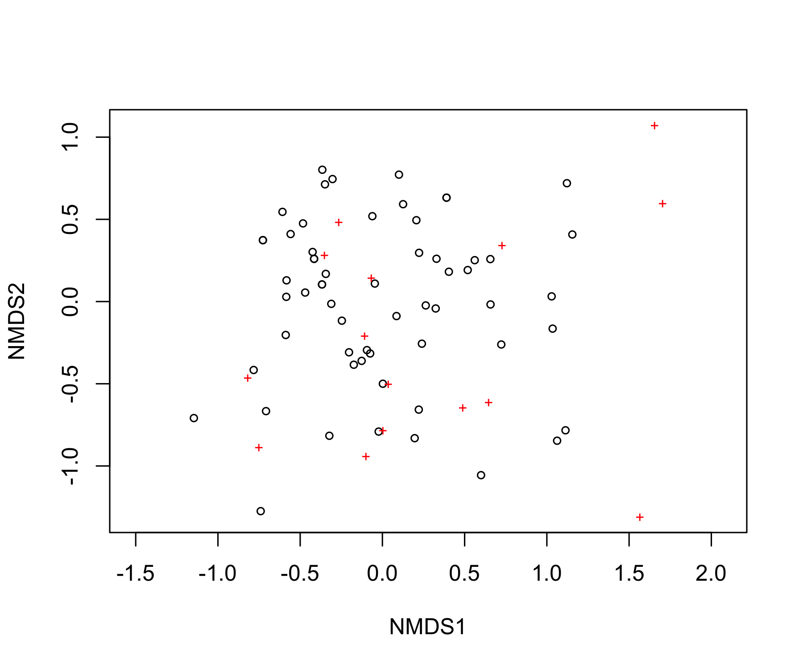
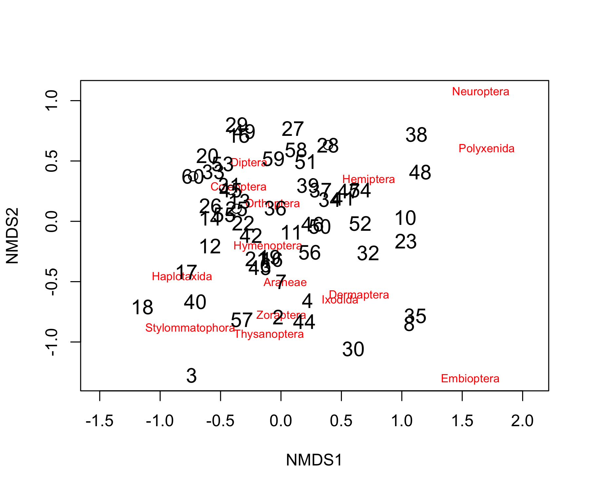
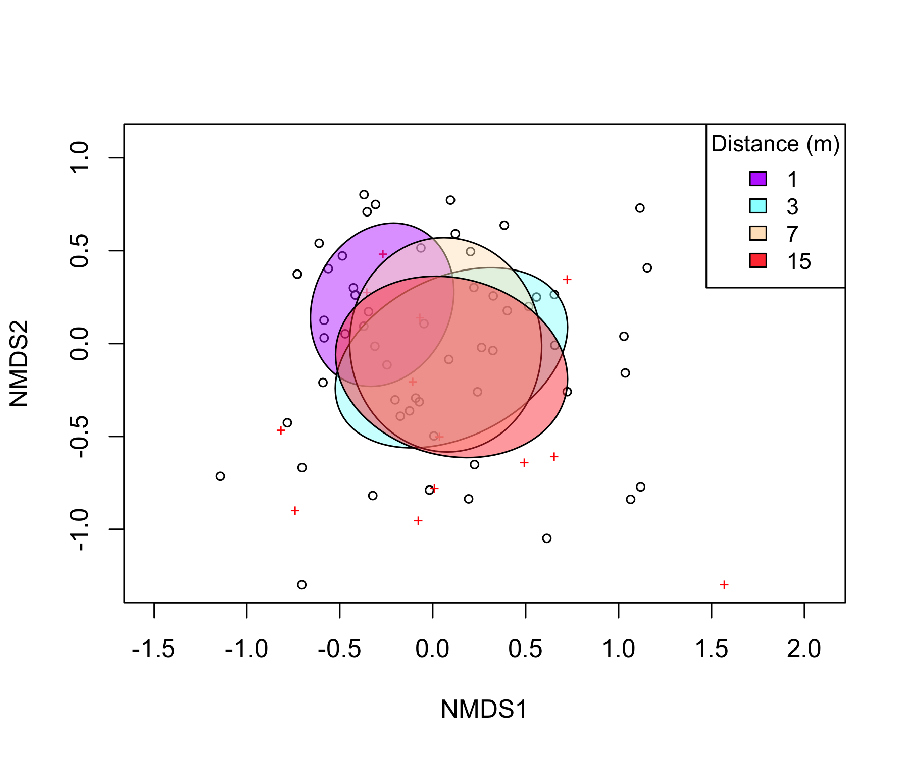
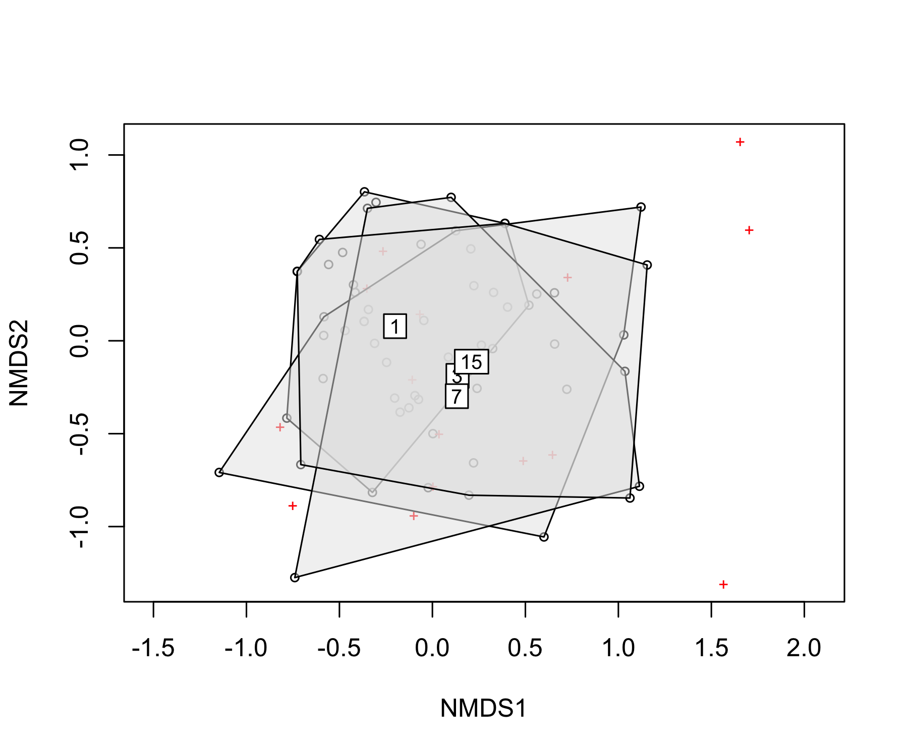
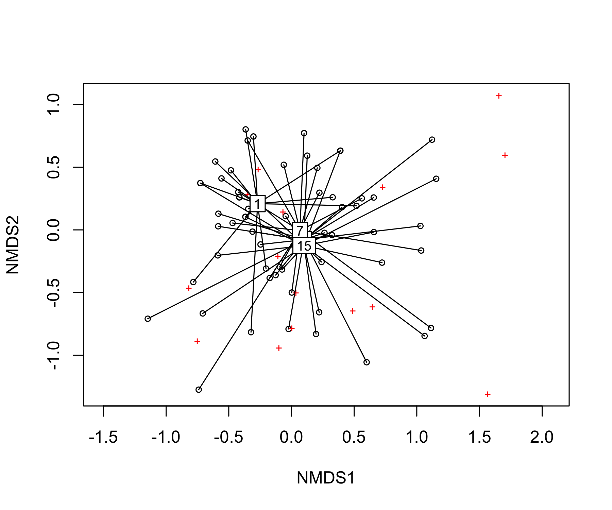
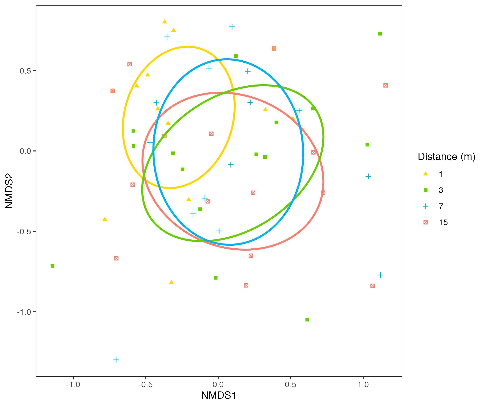
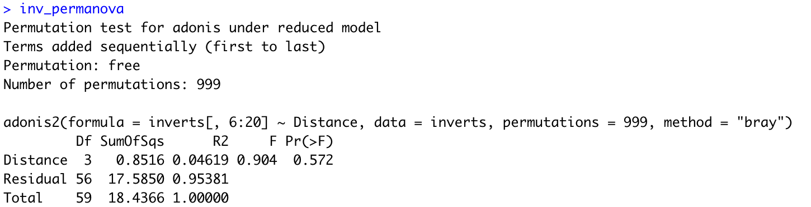
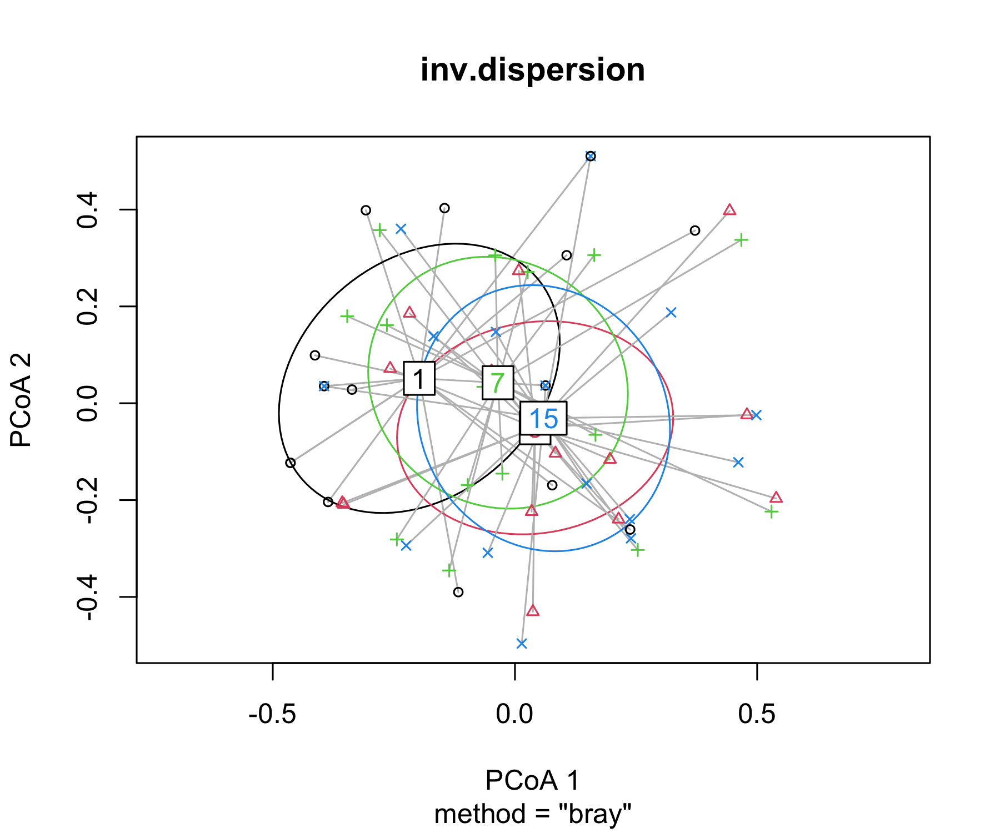
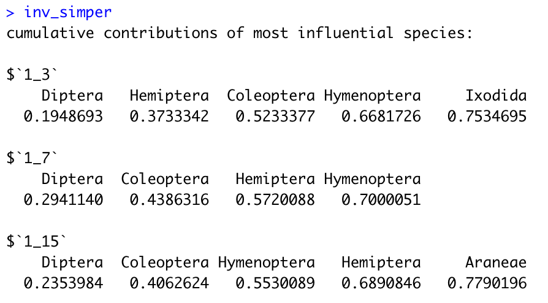

# Non-metric Multidimensional Scaling (NMDS)
*By Ray Rubia*

As an ecologist, have you ever wondered how to empirically visualise and test differences in community composition? Are you tired of constantly analysing complex diversity indices and their drivers in community ecology? Are you more interested in the assemblage of species/taxonomical units on which these indices build upon? If you've answered YES to any of the questions above then Christmas has come early for you! I present to you... Non-metric Multidimensional Scaling (NMDS)!!

This tutorial introduces you to the amazing world of NMDS ordinations, from basic visualization to statistical analysis of the results. This tutorial assumes good understanding of the basic principles of R and RStudio, so
if you have just started your R journey I suggest you work through <a href="https://ourcodingclub.github.io/tutorials/intro-to-r/" target="_blank">this tutorial</a> from the Coding Club. We will also be visualising data and building statistical models, so I recommend checking out the following tutorials if you aren't familiar with either of these things:
- Coding Club tutorial on data visualization using `ggplot2` package is available <a href="https://ourcodingclub.github.io/tutorials/datavis/" target="_blank"> here</a>
- Coding Club tutorial on introduction to model design is available <a href="https://ourcodingclub.github.io/tutorials/model-design/" target="_blank"> here</a>.

Advanced R users may also benefit and gain more from this tutorial by checking out <a href="https://ourcodingclub.github.io/tutorials/ordination/" target="_blank"> this tutorial</a> introducing ordinations and NMDS.

This tutorial will introduce the basics of NMDS ordinations. It will also teach you how to conduct and plot a simple NMDS. The second half of this tutorial is slightly more advanced and explores more advanced NMDS plotting as well as statistical modelling of NMDS results.

All files necessary to follow this tutorial can be found in <a href="https://github.com/EdDataScienceEES/tutorial-rayrr13" target="_blank"> this GitHub repository</a>. Download the repository as a ZIP file (clicking `Code/Download ZIP`) and unzip it in your local machine, or clone the repository to your own GitHub account.

### Tutorial Aims

#### <a href="#intro"> 1. Learn what Non-metric Multidimensional Scaling (NMDS) is</a>

#### <a href="#basicNMDS"> 2. Get familiar with conducting a basic NMDS using the `vegan` package</a>

#### <a href="#NMDSviz"> 3. Generate basic NMDS plots </a>

#### <a href="#advancedNMDSviz"> 4. Generate advanced NMDS plots</a>

#### <a href="#stats"> 5. Statistically analyse the results of an NMDS</a>

## 1. Learn what Non-metric Multidimensional Scaling (NMDS) is
***

Often in community ecology, research is mainly concerned with studying community diversity and its drivers. However, we are not only interested in how single variables affect/describe communities, we are also intrigued by the community composition itself. The assemblage of species/taxonomic units making up a community is of monumental significance as it determines the functional diversity of a community. Functional diversity encompasses all of the organismal traits that rule ecosystem functioning, dynamics, productivity and stability. This in turn will determine the ecosystem services that us as humans can yield from different habitats. Thus, it is important to understand community assemblages and identify their influencing factors. Nevertheless, these differences in community assemblages are hard and tedious to analyse so they tend to be overlooked.

Non-metric Multidimensional Scaling (NMDS) is a great tool for ecologists to answer this sort of questions. It can condense a lot of information about community species composition into something visible and understandable. For instance, consider a data frame/matrix with relative abundances of different species/other taxonomical units in different communities, where each species/taxonomical unit abundance in the community is an axis and each axis is a dimension (see Figure 1). What NMDS does is summarise all of that information into a 2-dimensional representation, showing the differences in community composition. It tries to represent the original position of a community within a multidimensional space as accurately as possible while also minimising the number of dimensions to easily plot and visualise.

*Figure 1. Example of multidimensional data seen through the lens of community ecology, where each species abundance is an axis and each axis is a dimension. Source: https://jonlefcheck.net/2012/10/24/nmds-tutorial-in-r/*

The way NMDS does this is through an indirect gradient analysis ordination approach, meaning it ordinates variables based on scores it generates from a distance matrix. The distance matrix is generated from a community by species (or other taxonomical units) matrix and distances were calculated by comparing pairwise distances (measure of difference in community composition) between 2 different communities in a low dimensional space. This distance matrix represents the compositional dissimilarity between 2 different communities/sites using species counts. But remember, NMDS is a rank-based approach, and once the distances are calculated they are substituted by ranks. The closer two communities are ranked, the more similar composition they have.

If you are still not convinced enough to use NMDS to analyse differences in community composition, here is a list of further reasons why NMDS is such an amazing approach:
- It is non-metric
	- NMDS does not require a normal distribution nor a linear relationship
	- Doesn't require a very specific distribution
	- This is great in ecology as most distributions tend to be skewed (few abundant species and many with low abundance).
- It can tolerate missing pairwise distances
- It can use any dissimilarity measure
	- Doesn't rely on Euclidean distances (classic absolute distance between two points), meaning it can accomodate to more kinds of data
	- Not sensitive to data transformation as absolute distance doesn't matter
- Can group communities based on quantitative, qualitative or mixed variables
- It is a commonly used technique in community ecology and has a well-precedented use
- It can be used for any taxonomic group, not just species, as long as the data fits your research question

Hopefully, you understand some of this hard theory and have a better understanding of what an NMDS is and how it works. To help you grasp and comprehend these concepts even better, we are going to illustrate them by running an example NMDS.

## 2. Get familiar with conducting a basic NMDS using the `vegan` package
***

Let's get NMDSing!!

You can either run this tutorial by running the pre-written script for this tutorial (see `scripts/tutorial_NMDS.R` in the tutorial repository) or by creating an empty script in R by clicking on `File/New File/R Script` where you can add your own notes and annotations to the code.

Start by setting your working directory to the file path where you have all of the necessary files for this tutorial (probably the folder you just downloaded) and load the packages necessary for this tutorial. This tutorial will be mainly based around the `vegan` package in R which is a great tool for descriptive community ecology analysis e.g. ordinations, diversity analysis and community dissimilarity analysis. This package was developed in GitHub by Finnish community ecologist Jari Oksanen and his development team.
~~~r
# set working directory----
setwd("your_filepath")

# load libraries----
library(vegan) # for diversity analysis and ordination methods
library(permute) # necessary to run vegan package
library(lattice) # necessary to run vegan package
library(tidyverse) # for efficient data manipulation and visualization, contains ggplot2, dplyr and tidyr packages
~~~
*Note: If you haven't installed these packages on your R environment yet you can run the code `install.packages("package_name")` to install them. The packages `permute` and `lattice` are necessary to ensure smooth running of all of the functions on the `vegan` package*

Today, we will be trying to find empirical evidence supporting the intermediate disturbance hypothesis (IDH) by using an NMDS analysis.

Some brief background about today's research topic: The Intermediate Disturbance Hypothesis (IDH) essentially states that diversity is maximised at intermediate levels of disturbance. At high levels of disturbance, good dispersers dominate the communities, not giving strong competitors a chance to settle. Conversely, at low rates of disturbance, stronger competitors dominate and competitively exclude weaker competitors (tend to be the good dispersers) and dominate the community. Thus, at different levels of disturbance, community assemblages should be different as at high levels we have rapid colonising species and at low levels we have competitively dominant species.

Now we can import our dataset. This data set was collected near Oban, Scotland during an undergraduate ecology field course by University of Edinburgh undergraduate students. It was collected to test the accuracy of the classic IDH theory in predicting how the frequency and intensity of disturbances affects diversity. The data can be found in the repository under `data/invert_data.csv` and can be imported as follows:
~~~r
# import data----
inverts <- read.csv("data/invert_data.csv")
~~~

The data consists of invertebrate order abundance measured at varying distances from paths (1, 3, 7 and 15 m). Distance from paths was used as a proxy to quantify different levels of disturbance. Data was collected using pitfall traps at each distance at 5 different grassland sites, along 3 different transects in each site, around Oban, Scotland, giving a total sample size of *n = 60*. The aim of the study is to see if communities at different distances from paths had different community composition and provided empirical evidence supporting the IDH. This leaves us with the following research question for our study: **Does the order composition of invertebrate communities vary at different distances from paths?**

*Note: In this case we can use order as our taxonomical unit of interest rather than species as it is the functional traits and their diversity (competitors vs dispersers) we are interested in, not the species themselves.*

***
### Conducting a basic NMDS

Before we carry out any sort of ordination, we first need to look at our data and analyse its structure as well as its variables.

~~~r
# view dataset structure
head(inverts)
str(inverts)
~~~

We can see that the dataset contains columns with information about environmental variables such as the site the data was collected at, the path type, the transect number and the distance from the path of each community. The "Orders" column indicates the total amount of orders found in each pitfall trap. The "Abundance" column indicates the total number of individuals found in each pitfall trap. However, we are more interested in all of the other columns which have information about invertebrate order abundance in the different communities. Each column is a different order and it contains information about that order's abundance in different communities. This will be the crucial data we use to construct our NMDS.

*Note: this data is in wide format. If your data is in long format and all variables regarding species abundance in a single column, you want to convert this data to wide format. This can be done using the `spread()` function from the `dplyr` package.*

Notice how the data is in the format of a dataset. However, as we said above, in order to conduct an NMDS we said that our dataset must take the shape of a community by species (or orders in this case) matrix. Thus, we have to extract the abundance values from our dataframe and turn them into a community by order matrix to ensure smooth running in the `vegan` package.
~~~r
# make community matrix by extracting abundance values from inverts dataframe
invert_community <- inverts[,6:20]

# turn data frame into matrix so it functions in the vegan package
invert_matrix <- as.matrix(invert_community)
~~~

We can now create our NMDS ordination by using the `metaMDS` function from the `vegan` package. We will save this NMDS as an object in our R environment (called "inv.NMDS").
~~~r
inv.NMDS <- metaMDS(invert_matrix, distance = "bray", k = 3, autotransform = TRUE, trymax=100)
~~~

Pay attention to the different arguments in the above line of code that illustrate the different decisions we have made. First, we call our newly created matrix object containing a community by order matrix.

Secondly, as classic Euclidean distances are sensitive to species/order abundances or absences, we have decided to use Bray-Curtis as our measure of distance to build our distance (or dissimilarity) matrix on which the NMDS runs on, indicated by the `distance = "bray"` argument. The distance measure used has a strong influence over the analysis and the final output, so selecting the right one is very important. Bray-Curtis is a distance measure commonly used in ecology in this sort of analysis for many reasons: (1) it is often used for raw count data (as is the case with our data), (2) it is invariant to changes in units, (3) it accounts for both species presence/absence as well as species abundance, (4) it is unaffected by additions or removals of species not ubiquitous across all communities, (5) it is unaffected by adding a new community, and (6) it recognizes differences in total species/order abundances when relative abundances are equal.

Next, we need to decide the reduced number of dimensions the NMDS algorithm will ordinate objects in. We communicate this to R through the `k = 3` argument. Increasing the number of dimensions will allow for a better representation of the original multidimensional distance matrix and lower NMDS stress values (goodness of fit). However, the more dimensions, the more challenging the interpretation becomes (especially if k > 3). Therefore, 2 or 3 dimensions are usually the consensus in ecology. We have decided to do 3 dimensions in order to provide a better fit to our data.

The `autotransform = TRUE` argument is simply to ensure that R performs a square-root transformation of the raw data before calculating Bray-Curtis distances (it is standard procedure in an NMDS). This reduces the relative influence of the most abundant species, so that they don't dominate the distance matrix.

Finally, it is worth noting that NMDS is an iterative algorithm, meaning it repeats the same process over and over again until it finds the best solution. The number of iterations you want it to run can be set by using the `trymax = ...` argument. In this case we have decided it to run 100 times. As it is an iterative algorithm, it is recommended to run an NMDS multiple times to ensure a stable solution has been reached.

Lets now assess how well our ordination has fitted our data by looking at its stress value:

~~~r
# check stress value
inv.NMDS$stress # ideally stress value is < 0.2
~~~

The stress of an NMDS indicates its goodness of fit. It is essentially the distance between the reduced dimensional space and the complete one. NMDS tries to optimise this as much as possible and it can be reduced by increasing the dimensionality of your ordination. Generally, stress values < 0.2 are considered a good fit, and stress values under 0.1 or 0.05 are ideal. In this case, we have a stress value of `~0.114`, indicating our ordination is a good fit for our data. The stress value of an NMDS should always be reported in the NMDS figure or NMDS figure caption.

And there you have it! You have now built your first NMDS, well done! We are now going to move on to the fun and interesting part which is plotting our NMDS results! But before, a few warnings to consider when working with an NMDS ordination:
#### **Warnings:**
- Beware of NMDS interpretation if you have high stress values
- After running an NMDS, the generated distance matrix is no longer raw data as pairwise distances have been calculated from that data, making the distance data interdependent
- Do not relate environmental variables to an NMDS ordination as it is only an approximate representation of the distance matrix. It is more relevant to relate variables to the distance matrix itself
- NMDS can be computationally demanding for large datasets
- As it is an iterative algorithm, each NMDS ordination or plot you generate from scratch can look slightly different.
- If you have an extremely low stress value your data might have too many zeros. R usually gives you a warning message about this anyways.

## 3. Generate basic NMDS plots
***
Let's get straight into plotting our NMDS! We will first use the `vegan` package and `Base R` to generate some simple NMDS plots. More advanced NMDS plotting using `ggplot2` will be explored in <a href="#advancedNMDSviz"> section 4</a> of this tutorial.

Let's start by plotting the most basic of NMDS plots.
~~~r
# data visualization----
# using vegan package and Base R
plot(inv.NMDS) # circles show different communities/sites, crosses show different species
~~~

This should generate the following plot:

*Figure 2. Basic representation of an NMDS, where circles show different communities and crosses show different invertebrate orders. NMDS stress = 0.114, n = 60*

As you can see, this plot doesn't give away much information. Each dot represents a different community and each cross represents a different invertebrate order. The closer 2 points are, the more similar those communities are in terms of composition. However, here it is hard to identify the position of different communities or species (orders in this case) because there are no labels or no other indicators. Let's add these! We will use the `ordiplot` and `orditorp` plotting functions embedded in the `vegan` package.

~~~r
ordiplot(inv.NMDS, type = "n") # create blank ordination plot
orditorp(inv.NMDS, display = "species", col="red", air = 0.1) # add species (orders in this case) names in red
orditorp(inv.NMDS, display = "sites", cex = 1.25, air = 0.1) # add site numbers in black
~~~

*Figure 3. NMDS representation with numbers representing the different sites and labels indicating the different species (orders in this case). NMDS stress = 0.114, n = 60*

We can now see what dot corresponds to each community and what cross
corresponds to each invertebrate order. The `air = ...` argument is simply just to add empty space around text labels. Nevertheless, the plot still looks a bit confusing and messy. It isn't telling us anything about the relationship between different environmental variables and community composition. It is simply telling us what communities are more similar to one another without giving any background environmental information for these communities.

Luckily enough, `vegan` has a solution to this! – It allows you to plot different shapes or lines around communities based on different grouping factors. Our research question is mainly concerned with how distance from disturbance (paths) affects invertebrate community composition. Thus, using the functionality of the `vegan` package we can add different shapes or lines grouping together communities (dots on the NMDS plot) at different distances. These plots can be ellipse plots, polygon plots or spider plots, among many others. This will allow us to understand our NMDS plots much better and will give a better visual representation of the effect distance from paths (disturbances) on community composition.

As it is my personal favourite and I think it is the best at depicting differences, I will thoroughly demonstrate how to create an ellipse plot using the `ordiellipse()` function from the `vegan` package and add all of the corresponding aesthetics. I will provide the key code to generate spider and polygon plots. If you prefer these and want to further develop them into a nicer plot, the aesthetics work exactly the same as for the ellipse plot.

#### **Ellipse plot**

We first create an NMDS ordination plot showing the dots (communities) and crosses (species, or orders in this case) and then overwrite this plot and add the ellipses grouping communities according to their distances from paths using the `ordiellipse()` functions. This will allow us to see if there is any distinction in community composition at different distances from paths. The less overlap there is among the ellipses, the more distinct communities at different distances from disturbances are. The rest of the arguments are for aesthetics: adding different colours to the ellipses, adjusting their transparency, removing title and adding a legend with the corresponding title and labels. You can adjust these aesthetics depending on personal preference.

~~~r
# ellipse plot
ordiplot(inv.NMDS) # plot shows communities (circles) and species (crosses)
ordiellipse(inv.NMDS, inverts$Distance, label = FALSE,
            col=c("darkorchid1", "darkslategray1", "bisque1", "brown1"),
            draw = "polygon", alpha=120) # adding ellipses to the plot, grouping by distance (inverts$Distance)
legend("topright", title="Distance (m)",
       c("1","3","7","15"), fill=c("darkorchid1", "darkslategray1", "bisque1",
                                   "brown1"), horiz=FALSE, cex=.9) # adding a legend

# save plot
png("your_filepath/image.png", width=6, height=5, units = "in", res = 300)
ordiplot(inv.NMDS)
ordiellipse(inv.NMDS, inverts$Distance, label = FALSE,
            col=c("darkorchid1", "darkslategray1","bisque1", "brown1"),
            draw = "polygon", alpha=120)
legend("topright", title="Distance (m)",
       c("1","3","7","15"), fill=c("darkorchid1", "darkslategray1",
                                   "bisque1", "brown1"), horiz=FALSE, cex=.9)
dev.off()
~~~
The plot should end up looking something like this:

*Figure 4. NMDS ellipse plot showing invertebrate community order composition at different distances from disturbances (paths). NMDS stress = 0.114, n = 60*

#### **Polygon plot**
Polygon plots are created just the same as ellipse plots, the only difference is that now we are using the `ordihull()` function rather than `ordiellipse()` to add polygons surrounding communities at different distances from  paths. If you want to add aesthetics or save this plot the code and arguments work exactly the same as for ellipse plots.

~~~r
# polygon plot
ordiplot(inv.NMDS) #plot shows communities (circles) and species (crosses)
ordihull(inv.NMDS, groups = inverts$Distance, draw="polygon", col="grey90", label = TRUE) # adding polygons to the plot, grouping by distance (inverts$Distance)
~~~
The plot should end up looking something like this:

*Figure 5. NMDS polygon plot showing invertebrate community order composition at different distances from disturbances (paths). NMDS stress = 0.114, n = 60*

#### **Spider plot**
Spider plots are created just the same as ellipse and polygon plots, the only difference is that now we are using the `ordispider()` function to add lines connecting all of the communities that are found at the same distance from disturbances. This way, we can see what communities are found at different distances and see if there are any distinctions in community assemblages. If you want to add aesthetics or save this plot the code and arguments work exactly the same as for ellipse plots.

~~~r
# spider plot
ordiplot(inv.NMDS) #plot shows communities (circles) and species (crosses)
ordispider(inv.NMDS, groups = inverts$Distance, label = TRUE) # adding spider plot, grouping by distance (inverts$Distance)
~~~
The plot should look something like this:

*Figure 6. NMDS spider plot showing invertebrate community order composition at different distances from disturbances (paths). NMDS stress = 0.114, n = 60*

Phew!! That was a lot of information to take in! We are now going to move on to more advanced NMDS plotting and some statistical analysis but let's take a breath first! Help yourself to a cup of tea or coffee or any other beverage of your choice. Get some fresh air and come prepared to tackle the second half of this tutorial!

*P.S. Don't be afraid to go over this first half again or revisit certain topics/definitions if you are struggling with grasping some of the concepts*

## 4. Generate advanced NMDS plots
***
Although we ended last section with some pretty neat ordination plots, but there is still room for improvement and our plots can be more aesthetic, up to professional standard. This is where the `ggplot2` package comes in handy, the legend of data visualization in R.

In this section, we are going to learn how to plot an NMDS ellipse plot using `ggplot2`. Once again, I have decided to do the ellipse plot as it is my personal favourite, but it is also possible to generate spider and polygon NMDS plots in `ggplot2`.

We will start by extracting the NMDS scores from the ordination and create a dataframe with it.
*Note: if the version of the `vegan` package you have installed is <2.6-2 then the following code should also work: `nmds.scores = as.data.frame(scores(nmds))`*
~~~r
# make new dataframe with by extracting NMDS scores
nmds.scores <- as.data.frame(scores(inv.NMDS)$sites) # for newest version of vegan package
~~~

We will now add all of the underlying environmental data into this new NMDS dataframe. This will be useful if we want to group communities base on different criteria in future analyses. We will also change our grouping variable of interest (distance) to a factor to make sure code runs smoothly when creating ellipses for communities at different distances.
~~~r
nmds.scores <- nmds.scores %>%
  mutate(Site = as.factor(inverts$Site), Path.Type = as.factor(inverts$Path.Type),
	Transect = as.factor(inverts$Transect),
	Distance = as.factor(inverts$Distance))

# check dataframe to ensure all changes have taken place
head(nmds.scores)
str(nmds.scores)
~~~

This newly created data frame is what we will use to plot the NMDS scores and coordinates of each communities.

Now, when it comes to adding the ellipses to this plot, things start to get complicated. We must define a hidden vegan function known as `veganCovEllipse`. This function essentially finds coordinates for drawing a covariance ellipse based on the grouping factor of your choice.

~~~r
# define hidden vegan function that finds coordinates for drawing a covariance ellipse
veganCovEllipse<-function (cov, center = c(0, 0), scale = 1, npoints = 100)
{
  theta <- (0:npoints) * 2 * pi/npoints
  Circle <- cbind(cos(theta), sin(theta))
  t(center + scale * t(Circle %*% chol(cov)))
}
~~~

Don't worry too much about the detail of that code, it simply finds the centroids and dispersion of the different ellipses based on a grouping factor of your choice.

We next have to create an empty data frame where we will be adding data containing the ellipse coordinates for plotting. We will fill this data frame by binding the NMDS data we have extracted in the dataframe `"nmds.scores"` with the coordinate data for the ellipses, using distance from paths as a grouping factor.

~~~r
# create empty dataframe to combine NMDS data with ellipse data
ellipse_df <- data.frame()

# adding data for ellipse, in this case using distance as a grouping factor
for(g in levels(nmds.scores$Distance)){
  ellipse_df <- rbind(ellipse_df, cbind(as.data.frame(with(nmds.scores[nmds.scores$Distance==g,],
                                                     veganCovEllipse(cov.wt(cbind(NMDS1,NMDS2),
                                                                            wt=rep(1/length(NMDS1),length(NMDS1)))$cov,
                                                                     center=c(mean(NMDS1),mean(NMDS2)))))
                                  ,Distance=g))
}
~~~

This is quite a complex line of code, so don't worry too much about understanding the code, but pay more attention to what the code is actually doing.

With both of these data frames (NMDS score data frame and ellipse coordinate data frame) we can now create an NMDS ellipse plot showing differences in community assemblages by using `ggplot2`. The NMDS scores will be our x and y variables, distance from paths will be our grouping variable to add different colours/point shapes and the ellipse dataframe coordinates is what we will use to plot our ellipses. Using `ggplot2` will always give you more flexibility with your graphing as well as giving a professional aesthetic to your figures.

I know you're excited now so... LET'S GET OUR PLOT!
~~~r
# create ggplot
(inv_NMDS_plot <- ggplot(data = nmds.scores, aes(NMDS1, NMDS2)) +
    geom_point(aes(color = Distance, shape = Distance)) + # adding different colours and shapes for points at different distances
    geom_path(data=ellipse_df, aes(x=NMDS1, y=NMDS2, colour=Distance), linewidth=1) + # adding covariance ellipses according to distance # use size argument if ggplot2 < v. 3.4.0
    guides(color = guide_legend(override.aes = list(linetype=c(NA,NA,NA,NA)))) + # removes lines from legend
    theme_bw() + # adding theme
    theme(panel.grid = element_blank()) + # remove background grid
    scale_color_manual(name = "Distance (m)", # legend title
                       labels = c("1","3","7","15"), # adjusting legend labels
                       values = c("gold", "chartreuse3",
                                  "deepskyblue2", "salmon")) + # customising colours
    scale_shape_manual("Distance (m)", # legend title
                       labels = c("1","3","7","15"), # adjusting legend labels
                       values = c(17, 15, 3, 7))) # customising shapes
# save plot
ggsave(filename = "your_filepath/figure.png, inv_NMDS_plot, device = "png")
~~~

Notice that a lot of this code is just `ggplot2` aesthetics that I have added to make the figure look nicer. You can customise these as you please! This leaves us with a beautiful plot that should look something like this:

*Figure 7. NMDS ellipse plot showing invertebrate community order composition at different distances from disturbances (paths). This was generated using `ggplot2`. NMDS stress = 0.114, n = 60*

Some of the code used to generate NMDS ellipse plots in `ggplot2` was inspired by Didzis Elferts answer on <a href="https://stackoverflow.com/a/13801089" target="_blank"> this Stack Overflow issue</a>.

## 5. Statistically analyse the results of an NMDS
***
So far we have been generating some stunning NMDS ordination plots and seen the invertebrate order composition at different distances from disturbances. However, we have not been interpreting the results and trying to answer our research questions: Does the invertebrate order composition differ at varying distances from disturbances?

We could assess this visually by looking at Figures 4 and 7. The more 2 ellipses overlap, the more similar the invertebrate order composition between the communities at those distances. Thus, we are looking to see if we see any distinct ellipses with very little overlap that would provide us with empirical evidence supporting the IDH (community composition will differ at varying distances from disturbances due to the disperser vs competitor trade-off). The visual assessment of Figures 4 and 7 seems to show a lot of overlap between the communities at different distances, indicating that they have quite a similar invertebrate order composition. Nevertheless, visual assessment of an ordination plot is not a thorough enough method that allows to truly detect if there is a significant difference or not. For this, we must call upon our trusted friend– stats!

There are many ways we could conduct a statistical analysis to assess if distance from disturbance affects invertebrate community order composition. I am going to outline the procedure to carry out a PERmutational Multivariate ANalysis Of VAriance (PERMANOVA), the most commonly used science distance-based method to test the association of community composition with covariates of interest (distance in this case). Other valid alternatives are ANOSIM test, Mantel test or a distance-based redundancy analysis.

The reason we're using a PERMANOVA instead of the simpler MANOVA (Multivariate ANalysis Of VAriance) is because the assumptions for the latter are usually violated. Other advantages of a PERMANOVA is that it doesn't require a specific data distribution, it is insensitive to multicollinearity (correlated predictor variables), it is insensitive to many zeros, it allows for multiple variables (multivariate analysis) and it can have differences in between-group variation.

PERMANOVA is a non-parametric multivariate analysis of variance that is similar to an ANOVA but instead deals with lots of variables. The way it works is by constructing an ANOVA-like test on a distance (dissimilarity) matrix. It is testing the null hypothesis that the centroids (mean) and dispersion (standard deviation) of all groups are equivalent across all groups. Rejecting this hypothesis means that either the centroid or the dispersion are different among groups, e.g. in our case this would mean that invertebrate community composition is significantly different at varying distances from disturbance. Like an ANOVA, it compares within group variation to the among group variation, producing a pseudo F-ratio, which is analogous to the ANOVA F-ratio. If among group variation is greater than within group variation, then the pseudo F-ratio gets larger.

As PERMANOVAS are carried out on a distance matrix, the prior calculation of one is essential. This is why it's such a suitable test to carry out after conducting an ordination such as NMDS or PCA (Principal Component Analysis) to test if community assemblage is significantly different. It's not done on the output of the ordination itself, but rather on the underlying distance matrices used to generate that output.

Let's build a PERMANOVA model to analyse our data and illustrate how this test works! We will be using the `adonis2()` function from the `vegan` package in R, which allows us to carry out PERMANOVAS on distance matrices.

~~~r
# data analysis----
# using a PERMANOVA to test the differences in community composition
# This is a PERmutational Multivariate ANalysis Of VAriance and tests the differences between groups, like an ANOVA, but with lots of variables.
# it is essentially a multivariate analysis of variance used to compare groups of objects
inv_permanova <- adonis2(as.matrix(inverts [,6:20]) ~ Distance, inverts,
                             permutations = 999, method = "bray")
# permutations is the number of possible arrangements the data could take
# using permutations = 999 is standard practice in science and across the literature
# can increase it if you want to get a more thorough analysis
# use method = bray as it is what we previously used to calculate pairwise distances
~~~

As you can see, the `adonis2()` function takes the columns containing order abundance information from the invertebrate dataset, treating them as a matrix, and it generates the distance matrix from them on which it runs the PERMANOVA. Neat, huh? Here, we must indicate "Distance" as our predictor variable and indicate the total number of permutations we want the test to run. Finally, we need to indicate the method to calculate the distance matrix with. In this case, we'll indicate Bray-Curtis, as it is the way we previously calculated the pairwise distances.

Now, let's see what kind of outputs this model generates (can view in R by simply calling the object you saved the model as).

*Note: As it is a permutational test, the output will slightly vary every time you run the model.*

*Figure 8. PERMANOVA summary outputs*

As previously discussed, we can see this model generates a pseudo F-ratio (column labelled F in Figure 8). It also generates an associated p-value, indicating the significance of the effect of our predictor variable. However, significance isn't assessed in the same conventional way we generate p-values in an ANOVA. In a PERMANOVA, significance is assessed via permutations.  

The p-value indicates the proportion of permuted pseudo F-ratios which are greater or equal to the observed statistic (before any permutation). In other words, do permuted datasets yield a better resolution (community composition separation) of groups relative to the actual dataset. If the actual dataset has more separation than most permuted datasets then we have a significant effect. The signficance threshold of p < 0.05 still stands for PERMANOVA.

Like every other statistical model, a PERMANOVA also has its own set of assumptions that must be met:
- Objects in the dataset are exchangeable under the null hypothesis
	- Objects (with their centroid (mean) and dispersion (standard deviation)) could be the same if the null hypothesis was true (no separation)
- Independent data points
- Similar multivariate dispersion (each group has a similar scatter)

Some of these assumptions rely on the experimental design, but others can be tested in R. For instance, the last assumption about homogeneous variances can be tested using the `betadisper()` function from the `vegan` package. It works in an analogous way to the Levene and Bartlett tests. If we run this test on the invertebrate community distance matrix, it will tell us if we have homogeneous variances in different groups.

~~~r
# check model assumptions
# check for multivariate homogeneity of group variances

# generate distance matrix from invertebrate commumunity matrix
inv.dist <- vegdist(invert_matrix, method = "bray")

# use betadisper test to check for multivariate homogeneity of group variances
inv.dispersion <- betadisper(inv.dist, group=inverts$Distance)
permutest(inv.dispersion)
~~~

As we can see from the outputs of the `permutest()` function, the test has given a non-significant result (p > 0.05), meaning that we have homogeneous variances and our model meets the assumptions. Therefore, model results can be trusted.

We can also visually assess this:
~~~r
# can also visually assess the assumptions
plot(inv.dispersion, hull = FALSE, ellipse=TRUE) # remove hulls and add ellipses
~~~

*Figure 9. PERMANOVA assumption check*

From the plot above (Figure 9) we can see that all groups seem to have similar dispersions.

Having successfully checked model assumptions, we can now proceed to interpret the results. The summary PERMANOVA output (Figure 8), indicates that there is no effect of distance on invertebrate community order composition, failing to provide evidence supporting the IDH. Thus, we can conclude that the invertebrate community order composition doesn't vary with different levels of disturbance, indicating no great functional differences among the different communities.

Although we trusted our model, some precautions must be considered when running a PERMANOVA test.

#### **Warnings:**
- Must ensure correct selection of permutation scheme, ensuring only exchangeable objects are permuted
- Misleadingly low p-values may result from groups of objects with equal centroids but different dispersions.
	- I recommend you evaluate and consider dispersion when interpreting your results
- It assumes balanced experimental designs

***
### Simper analysis
If you want a deeper look into your community composition analysis you can run further tests and analyses e.g. SIMPER analysis, indicator species analysis, among others. A SIMPER analysis (SIMilarity PERcentages analysis) determines the taxonomic untis that most contribute to the differences in community composition. The way it works is by breaking down the Bray-Curtis distance calculation and it generates the average contribution of each individual taxonomic unit in each pairwise comparison of all pf the groupings. However, its results should be interpreted with caution as it points out the most variable taxonomic units rather than the most distinctive ones.

This is not very relevant in our case as we have quite similar invertebrate community compositions, but I will run it as an example anyways. Once again, it can be done with functions embeded within the `vegan` package.

*Note: as it runs pairwise comparisons it only works for categorical variables, so it will treat any continuous variables as a factor*
~~~r
# simper analysis
# this is a SIMilarity PERcentage analysis and compares community differences
# and reports what species (orders in this scenario)are driving those differences.

inv_simper <- with(inverts[,c(1,2,3,4,5,21)], simper(as.matrix(inverts[,6:20]), Distance, permutations = 100))
# with argument indicates what grouping variables to use to conduct the analysis
# the number of permutations required to carry out the analysis

# see most influential species (orders in this case) contributing to community differences
inv_simper
~~~

*Figure 10. SIMPER analysis output*

A SIMPER analysis outputs the most important species in observing differences between a pair of groups. Species represented in this output are responsible for 70% of the observed variation. Each time it adds another taxonomic group it shows its cumulative contribution of rather than its individual one.

The snapshot of part of the SIMPER output in Figure 10 shows taxonomic units responsible for assemblage differences between communities at:
- 1 m vs 3 m
- 1 m vs 7 m
- 1 m vs 15 m

The rest of the pairwise comparisons should be visible to you in your R console.

A more detailed view of this output where we can see the contribution of every taxonomic unit present can be obtained using the `summary()` function:
~~~r
# a more detailed summary showing the contributions of all species (or orders)
summary(inv_simper)
~~~

*Figure 11. SIMPER summary output. In this case it only shows taxonomical responsible for assemblage differences in communities at 1 m vs 3 m, but your R console should show all of the pairwise comparisons.*

***
***

And that is it, you are now officially an NMDSer! Welcome to the incredible NMDS community!! Sadly, we didn't make any rivetting findings during this tutorial, but I hope it has helped you understand this wonderful way of viewing and analysing community ecology. Maybe one day you will use an NMDS in your own research and make ground-breaking discoveries!

Nevertheless, our intensive research, analysis and testing of invertebrate community composition at different distances hasn't been in vain. No result IS STILL a result! A possible explanation for this near-ubiquitous composition is that invertebrate are mobile organisms, so they homogenise all communities through migration and allow for no functional nor community assemblage differences. However, this study may have been limited by time and resource constraints. Future research could increase the sample size or geographical range of this study to reach a more solid conclusion. Who knows what we could've missed!

Anyways, that is all from me. I hope you have enjoyed this tutorial as much as I have enjoyed creating it. Here are some learning objectives for you to go over and check you have grasped the key concepts and the essence of this tutorial. In this tutorial we learned:

#### - What is an NMDS?
#### - Why should we care about NMDS and how is it useful?
#### - How to build a simple NMDS in R using the `vegan` package
#### - How to make simple NMDS ordination plots using the `vegan` package and Base R
#### - How to make more advanced NMDS ordination plots with the help of `ggplot2`
#### - How to statistically analyse the results of an NMDS using a PERMANOVA test
#### - How to take our analysis a step further by carrying out a SIMPER analysis
#### - HOW INVERTEBRATE COMMUNITY ASSEMBLAGES VARY (OR NOT) AT DIFFERENT DISTANCES FROM PATHS IN OBAN, SCOTLAND!!!

For more on the `vegan` package and its amazingly versatile functionality, check out the official <a href="https://www.mooreecology.com/uploads/2/4/2/1/24213970/vegantutor.pdf" target="_blank">vegan tutor</a>.

#### Check out the <a href="https://ourcodingclub.github.io/links/" target="_blank">Useful links</a> page from Coding Club where you can find loads of guides and cheatsheets.

#### If you have any questions about completing this tutorial, please contact us on ourcodingclub@gmail.com

<ul class="social-icons">
	<li>
		<h3>
			<a href="https://twitter.com/our_codingclub" target="_blank">&nbsp;Join an amazing community and follow our coding adventures on Twitter! <i class="fa fa-twitter"></i></a>
		</h3>
	</li>
</ul>
