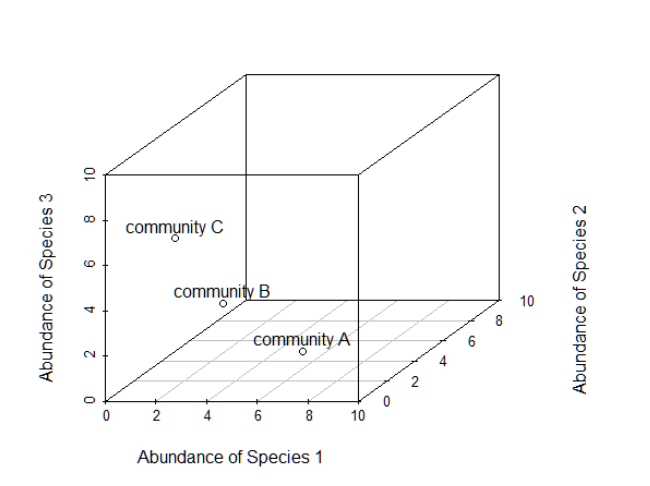

# Non-metric Multidimensional Scaling (NMDS)
*By Ray Rubia*

As an ecologist, have you ever wondered how to empirically visualise and test differences in community composition? Are you tired of constantly analysing complex diversity indices and their drivers in community ecology? Are you more interested in the assemblage of species/taxonomical units on which these indices build upon? If you've answered YES to any of the questions above then Christmas has come early for you! I present to you... Non-metric Multidimensional Scaling (NMDS)!!

This tutorial introduces you to the amazing world of NMDS ordinations, from basic visualization to statistical analysis of the results. This tutorial assumes good understanding of the basic principles of R and RStudio, so
if you have just started your R journey I suggest you work through <a href="https://ourcodingclub.github.io/tutorials/intro-to-r/" target="_blank">this tutorial</a> from the Coding Club. We will also be visualising data and building statistical models, so I recommend checking out the following tutorials if you aren't familiar with either of these things:
- Coding Club tutorial on data visualization using `ggplot2` package is available <a href="https://ourcodingclub.github.io/tutorials/datavis/" target="_blank"> here</a>
- Coding Club tutorial on introduction to model design is available <a href="https://ourcodingclub.github.io/tutorials/model-design/" target="_blank"> here</a>.

Advanced R users may also benefit and gain more from this tutorial by checking out <a href="https://ourcodingclub.github.io/tutorials/ordination/" target="_blank"> this tutorial</a> introducing ordinations and NMDS.

This tutorial will introduce the basics of NMDS ordinations. It will also teach you how to conduct and plot a simple NMDS. The second half of this tutorial is slightly more advanced and explores more advanced NMDS plotting as well as statistical modelling of NMDS results.

All files necessary to follow this tutorial can be found in <a href="https://github.com/EdDataScienceEES/tutorial-rayrr13" target="_blank"> this GitHub repository</a>. Download the repository as a ZIP file (clicking `Code/Download ZIP`) and unzip it in your local machine, or clone the repository to your own GitHub account.

### Tutorial Aims

#### <a href="#intro"> 1. Learn what Non-metric Multidimensional Scaling (NMDS) is</a>

#### <a href="#basicNMDS"> 2. Get familiar with conducting a basic NMDS using the `vegan` package</a>

#### <a href="#NMDSviz"> 3. Generate basic NMDS plots </a>

#### <a href="#advancedNMDSviz"> 4. Generate advanced NMDS plots</a>

#### <a href="#stats"> 5. Statistically analyse the results of an NMDS</a>

<a name="intro"></a>

## 1. Learn what Non-metric Multidimensional Scaling (NMDS) is

Often in community ecology, research is mainly concerned with studying community diversity and its drivers. However, we are not only interested in how single variables affect/describe communities, we are also intrigued by the community composition itself. The assemblage of species/taxonomic units making up a community is of monumental significance as it determines the functional diversity of a community. Functional diversity encompasses all of the organismal traits that rule ecosystem functioning, dynamics, productivity and stability. This in turn will determine the ecosystem services that us as humans can yield from different habitats. Thus, it is important to understand community assemblages and identify their influencing factors. Nevertheless, these differences in community assemblages are hard and tedious to analyse so they tend to be overlooked.

Non-metric Multidimensional Scaling (NMDS) is a great tool for ecologists to answer this sort of questions. It can condense a lot of information about community species composition into something visible and understandable. For instance, consider a data frame/matrix with relative abundances of different species/other taxonomical units in different communities, where each species/taxonomical unit abundance in the community is an axis and each axis is a dimension (see Figure 1). What NMDS does is summarise all of that information into a 2-dimensional representation, showing the differences in community composition. It tries to represent the original position of a community within a multidimensional space as accurately as possible while also minimising the number of dimensions to easily plot and visualise.

<center></center>
*Figure 1. Example of multidmensional data seen through the lens of community ecology, where each species abundance is an axis and each axis is a dimension. Source: https://jonlefcheck.net/2012/10/24/nmds-tutorial-in-r/*

The way NMDS does this is through an indirect gradient analysis ordination approach, meaning it ordinates variables based on scores it generates from a distance matrix. The distance matrix is generated from a community by species (or other taxonomical units) matrix and distances were calculated by comparing pairwise distances (measure of difference in community composition) between 2 different communities in a low dimensional space. This distance matrix represents the compositional dissimilarity between 2 different communities/sites using species counts. But remember, NMDS is a rank-based approach, and once the distances are calculated they are substituted by ranks. The closer two communities are ranked, the more similar composition they have.

If you are still not convinced enough to use NMDS to analyse differences in community composition, here is a list of further reasons why NMDS is such an amazing approach:
- It is non-metric
	- NMDS does not require a normal distribution nor a linear relationship
	- Doesn't require a very specific distribution
	- This is great in ecology as most distributions tend to be skewed (few abundant species and many with low abundance).
- It can tolerate missing pairwise distances
- It can use any dissimilarity measure
	- Doesn't rely on Euclidean distances (classic absolute distance between two points), meaning it can accomodate to more kinds of data
	- Not sensitive to data transformation as absolute distance doesn't matter
- Can group communities based on quantitative, qualitative or mixed variables
- It is a commonly used technique in community ecology and has a well-precedented use
- It can be used for any taxonomic group, not just species, as long as the data fits your research question

Hopefully, you understand some of this hard theory and have a better understanding of what an NMDS is and how it works. To help you grasp and comprehend these concepts even better, we are going to illustrate them by running an example NMDS.

Warnings about NMDS (maybe save for later section)

<a name="basicNMDS"></a>

## 2. Get familiar with conducting a basic NMDS using the `vegan` package

Let's get NMDSing!!

You can either run this tutorial by running the pre-written script for this tutorial (see `scripts/tutorial_NMDS.R` in the tutorial repository) or by creating an empty script in R by clicking on `File/New File/R Script` where you can add your own notes and annotations to the code.

Start by setting your working directory to the file path where you have all of the necessary files for this tutorial (probably the folder you just downloaded) and load the packages necessary for this tutorial. This tutorial will be mainly based around the `vegan` package in R which is a great tool for descriptive community ecology analysis e.g. ordinations, diversity analysis and community dissimilarity analysis. This package was developed in GitHub by Finnish community ecologist Jari Oksanen and his development team.
~~~r
# set working directory----
setwd("your_filepath")

# load libraries----
library(vegan) # for diversity analysis and ordination methods
library(permute) # necessary to run vegan package
library(lattice) # necessary to run vegan package
library(tidyverse) # for efficient data manipulation and visualization, contains ggplot2, dplyr and tidyr packages
~~~
*Note: If you haven't installed these packages on your R environment yet you can run the code `install.packages("package_name")` to install them. The packages `permute` and `lattice` are necessary to ensure smooth running of all of the functions on the `vegan` package*

Some brief background for our research question today: The IDH essentially states that diversity is maximised at intermediate levels of disturbance. At high levels of disturbance, good dispersers dominate the communities, not giving strong competitors a chance to settle. Conversely, at low rates of disturbance, stronger competitors dominate and competitively exclude weaker competitors (tend to be the good dispersers) and dominate the community. Thus, at different levels of disturbance, community assemblages should be different as at high levels we have rapid colonising species and at low levels we have competitively dominant species.

Now we can import our dataset. This data set was collected near Oban, Scotland during an undergraduate ecology field course by University of Edinburgh undergraduate students. It was collected to test the accuracy of the classic intermediate disturbance hypothesis (IDH) in predicting how the frequency and intensity of disturbances affects diversity. The data can be found in the repository under `data/invert_data.csv` and can be imported as follows:
~~~r
# import data----
inverts <- read.csv("data/invert_data.csv")
~~~

The data consists of invertebrate order abundance measured at varying distances from paths (1, 3, 7 and 15 m). Distance from paths was used as a proxy to quantify different levels of disturbance. Data was collected using 1 m<sup>2</sup> quadrats at each distance at 5 different grassland sites, along 3 different transects in each site, around Oban, Scotland, giving a total sample size of *n = 60*. The aim of the study is to see if communities at different distances from paths had different community composition and provided empirical evidence supporting the IDH. This leaves us with the following research question for our study: **Does the order composition of invertebrate communities vary at different distances from paths?**

*Note: In this case we can use order as our taxonomical unit of interest rather than species as it is the functional traits and their diversity (competitors vs dispersers) we are interested in, not the species themselves.*

***
### Conducting a basic NMDS

Before we carry out any sort of ordination, we first need to look at our data and analyse its structure as well as its variables.

~~~r
# view dataset structure
head(inverts)
str(inverts)
~~~

We can see that the dataset contains columns with information about environmental variables such as the site the data was collected at, the path type, the transect number and the distance from the path of each community. The "Orders" column indicates the total amount of orders found in each quadrat. The "Abundance" column indicates the total number of individuals found in each quadrat. However, we are more interested in all of the other columns which have information about invertebrate order abundance in the different communities. Each column is a different order and it contains information about that order's abundance in different communities. This will be the crucial data we use to construct our NMDS.

*Note: this data is in wide format. If your data is in long format and all variables regarding species abundance in a single column, you want to convert this data to wide format. This can be done using the `spread()` function from the `dplyr` package.*

Notice how the data is in the format of a dataset. However, as we said above, in order to conduct an NMDS we said that our dataset must take the shape of a community by species (or orders in this case) matrix. Thus, we have to extract the abundance values from our dataframe and turn them into a community by order matrix to ensure smooth running in the `vegan` package.
~~~r
# make community matrix by extracting abundance values from inverts dataframe
invert_community <- inverts[,6:20]

# turn data frame into matrix so it functions in the vegan package
invert_matrix <- as.matrix(invert_community)
~~~

We can now create our NMDS ordination by using the `metaMDS` function from the `vegan` package. We will save this NMDS as an object in our R environment (called "inv.NMDS").
~~~r
inv.NMDS <- metaMDS(invert_matrix, distance = "bray", k = 3, autotransform = TRUE, trymax=100) 
~~~


<a name="NMDSviz"></a>

## 3. Generate basic NMDS plots
You can add more text and code, e.g.

```r
# Create fake data
x_dat <- rnorm(n = 100, mean = 5, sd = 2)  # x data
y_dat <- rnorm(n = 100, mean = 10, sd = 0.2)  # y data
xy <- data.frame(x_dat, y_dat)  # combine into data frame
```

Here you can add some more text if you wish.

```r
xy_fil <- xy %>%  # Create object with the contents of `xy`
	filter(x_dat < 7.5)  # Keep rows where `x_dat` is less than 7.5
```

And finally, plot the data:

```r
ggplot(data = xy_fil, aes(x = x_dat, y = y_dat)) +  # Select the data to use
	geom_point() +  # Draw scatter points
	geom_smooth(method = "loess")  # Draw a loess curve
```

At this point it would be a good idea to include an image of what the plot is meant to look like so students can check they've done it right. Replace `IMAGE_NAME.png` with your own image file:

<center>  </center>

<a name="advancedNMDSviz"></a>

## 4. Generate advanced NMDS plots
More text, code and images.


<a name="stats"></a>

## 5. Statistically analyse the results of an NMDS</a>

This is the end of the tutorial. Summarise what the student has learned, possibly even with a list of learning outcomes. In this tutorial we learned:

##### - how to generate fake bivariate data
##### - how to create a scatterplot in ggplot2
##### - some of the different plot methods in ggplot2

We can also provide some useful links, include a contact form and a way to send feedback.

For more on `ggplot2`, read the official <a href="https://www.rstudio.com/wp-content/uploads/2015/03/ggplot2-cheatsheet.pdf" target="_blank">ggplot2 cheatsheet</a>.

Everything below this is footer material - text and links that appears at the end of all of your tutorials.
<hr>
<hr>

#### Check out our <a href="https://ourcodingclub.github.io/links/" target="_blank">Useful links</a> page where you can find loads of guides and cheatsheets.

#### If you have any questions about completing this tutorial, please contact us on ourcodingclub@gmail.com

#### <a href="INSERT_SURVEY_LINK" target="_blank">We would love to hear your feedback on the tutorial, whether you did it in the classroom or online!</a>

<ul class="social-icons">
	<li>
		<h3>
			<a href="https://twitter.com/our_codingclub" target="_blank">&nbsp;Follow our coding adventures on Twitter! <i class="fa fa-twitter"></i></a>
		</h3>
	</li>
</ul>

### &nbsp;&nbsp;Subscribe to our mailing list:
<div class="container">
	<div class="block">
        <!-- subscribe form start -->
		<div class="form-group">
			<form action="https://getsimpleform.com/messages?form_api_token=de1ba2f2f947822946fb6e835437ec78" method="post">
			<div class="form-group">
				<input type='text' class="form-control" name='Email' placeholder="Email" required/>
			</div>
			<div>
                        	<button class="btn btn-default" type='submit'>Subscribe</button>
                    	</div>
                	</form>
		</div>
	</div>
</div>
